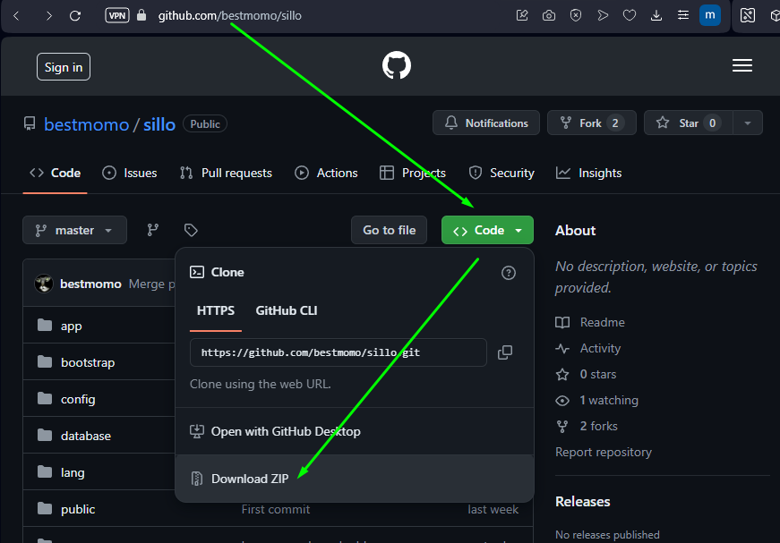
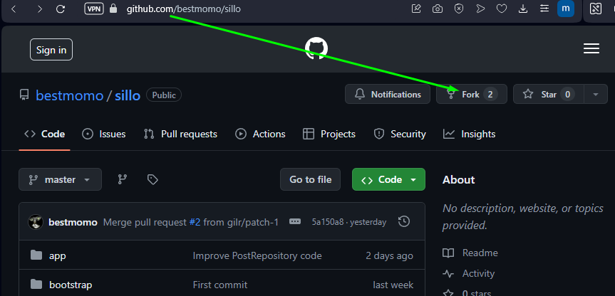
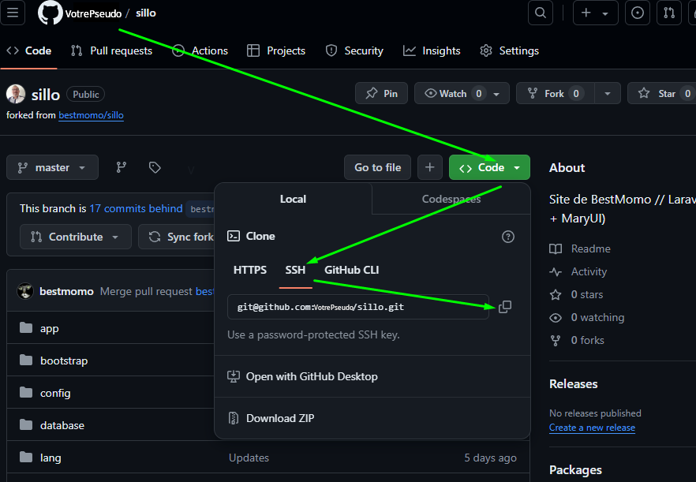

# Installation

[Retour à la la table des matières](README.md)

### &nbsp;I / Récupérez le dépôt:

##### Optez pour l'un des moyens ci-dessous:

- Pour 'juste' avoir tout en local en 1 minute
  (Même pas besoin d'avoir de compte GitHub et néanmoins récupérer tout le code pleinement opérationnel !):<br>
  
  Décompressez puis passez au **II /** ci-dessous.
  
<p align="center">Ou:</p>

- Vous voulez avoir tout cela, mais en plus, la possibilité de partager vos propres changements à venir ?<br>
      1. ***Forkez*** le projet **[sillo **de** BestMomo](https://github.com/bestmomo/sillo)**
      <sub>(À ce stade, il vous faut vous loguer dans votre compte Github, voire le créer en 30 secondes si vous n'en avez pas déjà un...)</sub><br>
      <br>
      2. ***Clonez*** le code de **VOTRE** copie du dépôt distant (Chez GitHub) sur votre serveur local via SSH :<br>
    `git clone git@github.com:Votre_Pseudo_GitHub/sillo.git`<br>
    
    *En cas de doute, juste récupérer cela ici:*<br>
      <br>
    
    <sub>(Si cela échoue, autant régler le problème, car pour uploader (***push***) vos futurs changements, ne serait-ce sur votre propre dépôt distant, il le faudra! Dans ce cas: [Installez votre clé SSH](https://docs.github.com/fr/authentication/connecting-to-github-with-ssh/generating-a-new-ssh-key-and-adding-it-to-the-ssh-agent))</sub>
  
### II / Installez votre propre version locale: 

Créez un fichier **.env** (Copier/Coller du **.env_example** que vous trouvez à la racine) et adaptez si souhaité, avec vos éléments, comme par exemple d'autres paramètres pour la connexion à la base de données.<br>
Puis procédez à l'installation :<br>

  `composer install`<br>
  `php artisan key:generate`<br>
  `php artisan storage:link`<br>
  `npm install`<br>
  `php artisan migrate --seed`<br>
    
  La population crée des utilisateurs dont un administrateur avec l'email **admin@example.com** et le mot de passe **password**. Elle crée aussi des catégories, des séries, des articles (Les images sont déjà présentes), des pages, des menus, des commentaires et des contacts. Vous obtenez donc un site fonctionnel et déjà bien garni.
  
# Utilisation

Pour bénéficier de la puissance complète du système Laravel avec ViteJS, il vous faut 2 consoles:

- L'une pour le côté Frontend

```
npm run dev
```

- L'autre pour le Backend

```
php artisan serv 
```

Ceci suffira si vous utilisez sqlite comme driver de BdD (Base de données ), que vous aurez renseigné dans le ***.env*** à la racine du projet.

Par contre, si vous souhaitez absolument utiliser **MySQL**, ou autre, il vous faudra aussi un serveur de Base de données.

*(À noter que pour les utilisateurs **Windows**, une solution parmi 1000, permet de démarrer en un clic, le serveur **Apache** (Backend) et celui de **MySQL** - *Et même accessoirement un serveur email local !* :* [Laragon](https://laragon.org/download/)*)*

🎉 Là, BRAVO ! Vous êtes opérationnel ! Ouvrez votre navigateur à l'URL `http://127.0.0.1:8000` et commencez à explorer votre application Laravel !

N.B.: Ce n'est là, qu'une façon parmi 10 000, de mettre en route son environnement local de dev... N'hésitez pas à 'fouiller' sur le web 😉 !

  
# *Updates* (Mises à jour): Restez 100 % 'à jour' 😊 !

À chaque ***push***, ou encore, contribution de l'un d'entre nous, par ***PR (Pull Request)*** accepté et ***merged*** (fusionné), c'est une véritable nouvelle version qui voit le jour dans le dépôt...

Pour rester complètement à jour:

1) Soyez en avisé: [Canal discord](https://discord.com/channels/423853760939556865/1253369416477835307)
   
2) Connaissez les commandes de base:

Mettez à jour votre dépôt local:
```
git fetch
```

Ensuite, pour appliquer les changements à votre branche locale :
```
git pull
```

### Mise à jour des dépendances

Après avoir récupéré les dernières modifications, il est souvent nécessaire de mettre à jour les dépendances du projet :

1. Pour les dépendances PHP :
```
composer update
```

2. Pour les dépendances JavaScript :
```
npm i
```
ou
```
yarn
```

### Mise à jour de la base de données

Si des modifications ont été apportées à la structure de la base de données, vous devrez exécuter les migrations :

```
php artisan migrate
```

Pour rafraîchir complètement la base de données et la repeupler avec des données de test :

```
php artisan migrate:refresh --seed
```

### Changement de branche 🌿

⚠️ **IMPORTANT** : Ne développez jamais directement dans la branche `master` qui correspond au dépôt d'origine, à votre fork et à votre copie en local ! Créez toujours votre propre branche (Voir le 5. ci-dessous) pour développer et coder en toute liberté.

Voici comment gérer vos branches efficacement :

1. 📋 Listez les branches disponibles :
```
git branch
```

2. 🔗 Pour voir les branches distantes (remotes), utilisez :
```
git branch -r
```

3. 🌐 Pour ajouter un nouveau dépôt distant :
```
git remote add nom_du_remote url_du_depot
```
Par exemple :
```
git remote add upstream https://github.com/utilisateur/repo_original.git
```

4. 🔀 Changez de branche :
```
git checkout nom_de_la_branche
```
ou avec Git version 2.23 et supérieure :
```
git switch nom_de_la_branche
```

5. 🌱 Créez une nouvelle branche et basculez immédiatement dessus :
```
git checkout -b ma_nouvelle_branche
```
ou
```
git switch -c ma_nouvelle_branche
```

6. 💻 Développez et codez à volonté dans votre nouvelle branche.

7. 🔄 Lorsque vous avez terminé et que vous souhaitez fusionner vos modifications :
8. 
   - Revenez sur la branche principale (généralement `master` ou `main`) :
     ```
     git switch master
     ```
   - Fusionnez votre branche de développement :
     ```
     git merge ma_nouvelle_branche_de_dev
     ```

🚨 N'oubliez pas de toujours vérifier sur quelle branche vous vous trouvez avant de commencer à travailler !

💡 Astuce : Utilisez `git branch` ou `git status` pour vérifier votre branche actuelle à tout moment.

📚 Pour voir toutes les branches (locales et distantes) :
```
git branch -a
```
*(À noter qu'il existe de nombreux système de visualisation graphique des braches... Par exemple, pour les utilsateur de VSC (* **Visual Studio Code** *), une extension, GG (* **GitGraph** *) en est un excellent - Vous pouvez y faire toutes les opérations courantes sans utiliser de console !!!)*

Et n'oubliez jamais...:


